<!-- # All Badges -->
#  Badges Completas
[Retornar para a pasta raiz](../)

Nesta pasta são exibidas todas as badges conquistadas ao longo das atividades realizadas, incluindo cursos, bootcamps, programas e eventos, sem separação por categoria.

<a href="https://github.com/PedroHeeger/boot/tree/main/dio/docker/boot_006">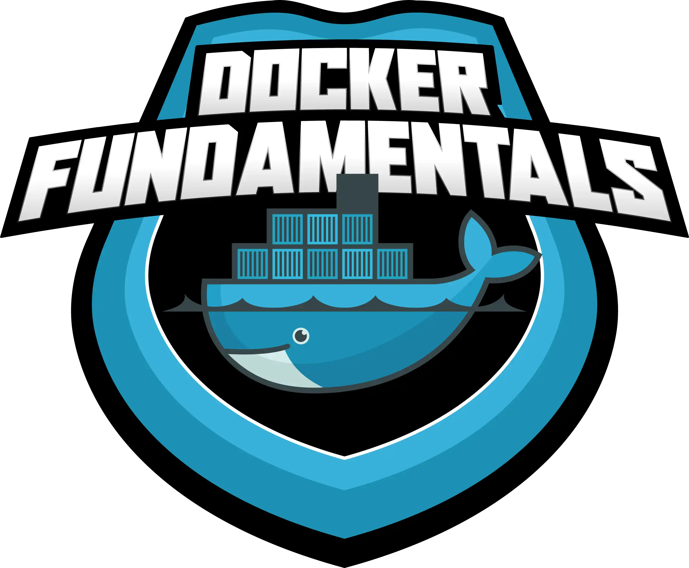</a>

<a href="https://github.com/PedroHeeger/boot/tree/main/dio/java/boot_010">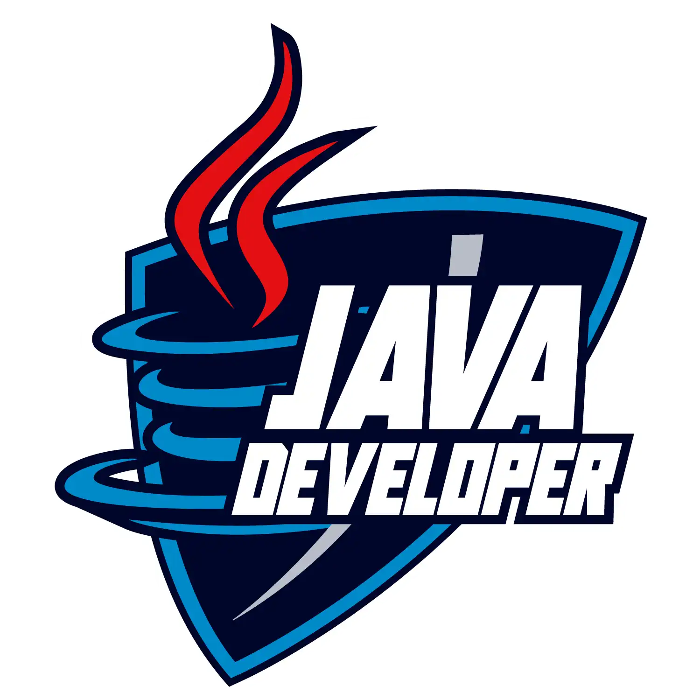</a>

<a href="https://github.com/PedroHeeger/boot/tree/main/dio/aws/boot_013">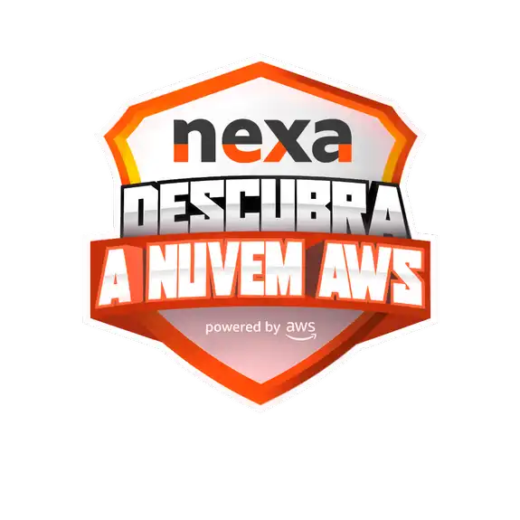</a>
<a href="https://github.com/PedroHeeger/boot/tree/main/dio/aws/boot_014">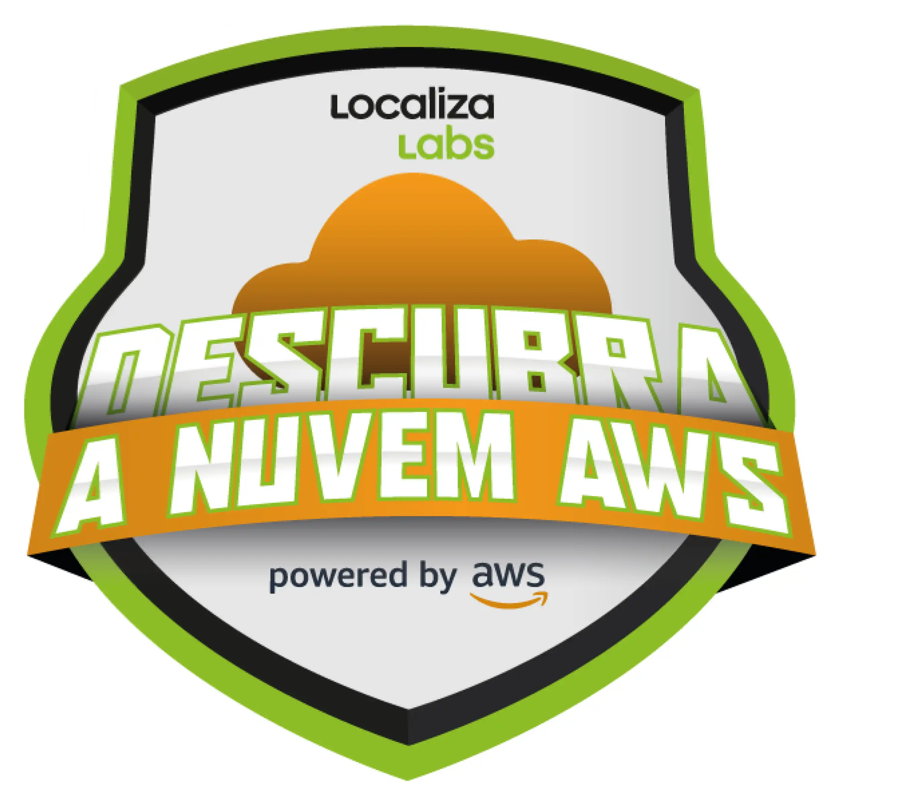</a>
<a href="https://github.com/PedroHeeger/boot/tree/main/dio/kubernetes/boot_015">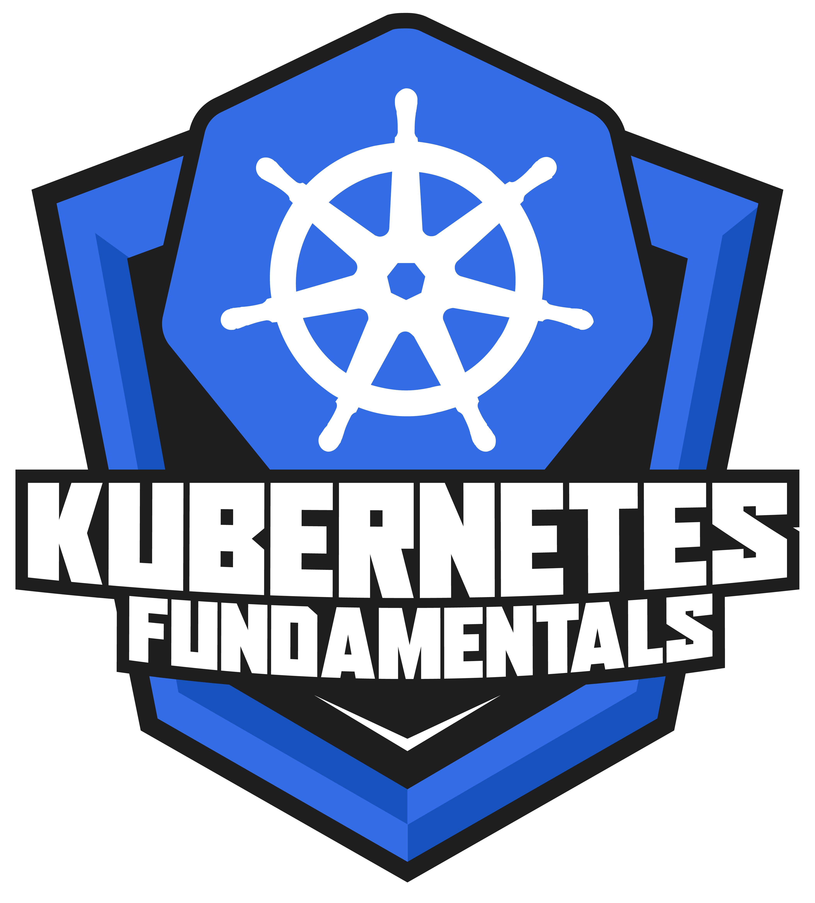</a>

<a href="https://github.com/PedroHeeger/boot/tree/main/dio/blockchain/boot_026/">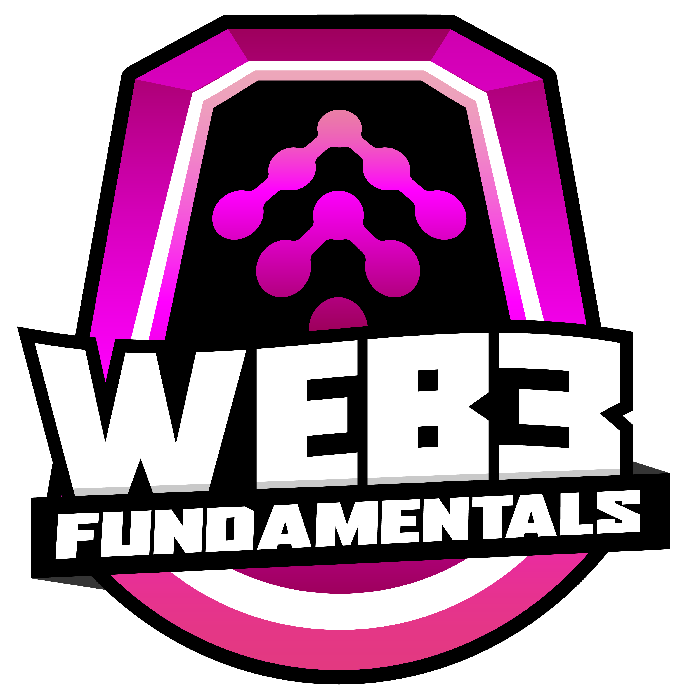</a>

<a href="https://github.com/PedroHeeger/boot/tree/main/dio/ai/boot_028">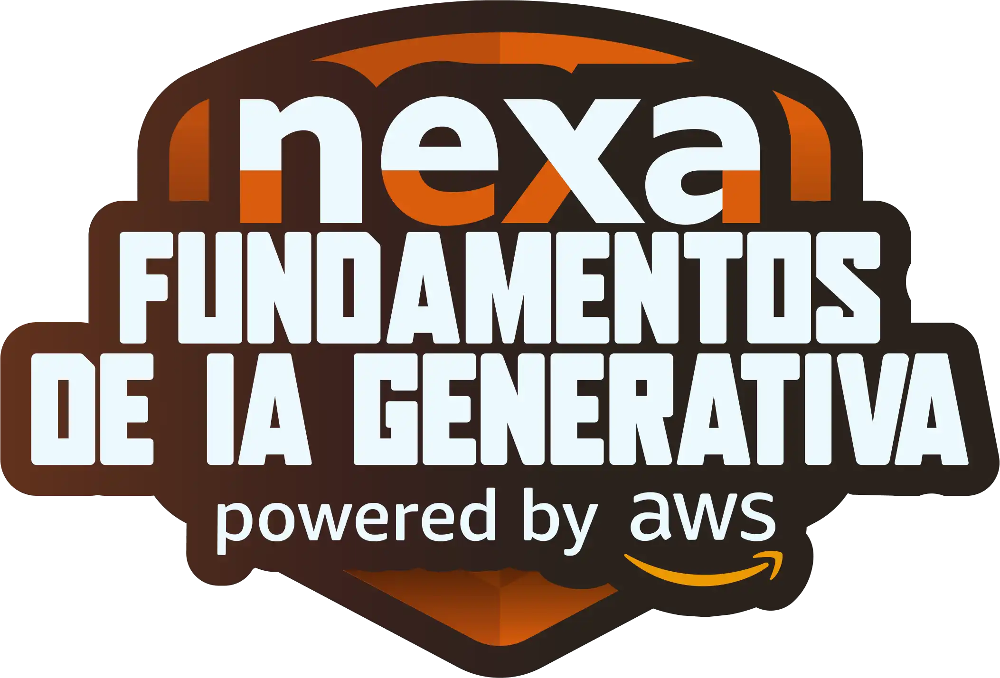</a>
<a href="https://github.com/PedroHeeger/boot/tree/main/dio/ai/boot_029">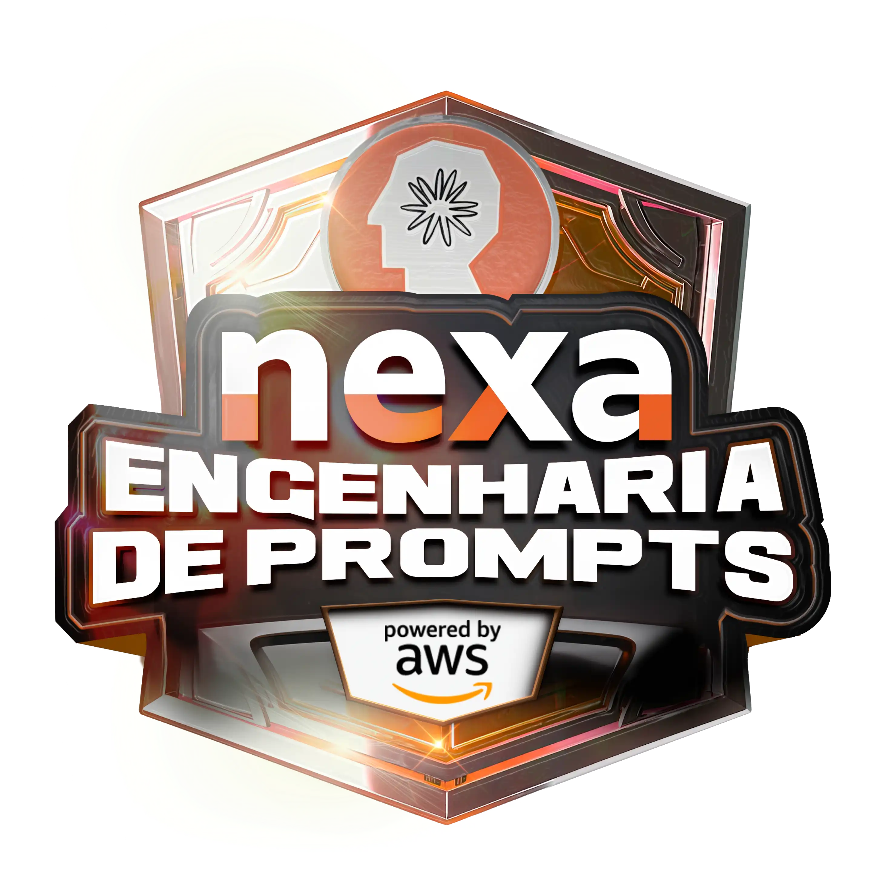</a>

<a href="../credentials/badges/events/devops/220803_Docker_PH_Iniciativa_Devops.png">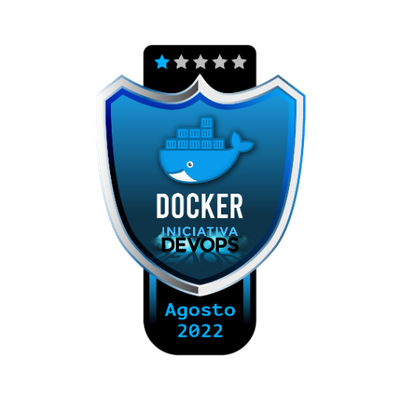</a>
<a href="../credentials/badges/events/devops/220805_Kubernetes_PH_Iniciativa_Devops.png">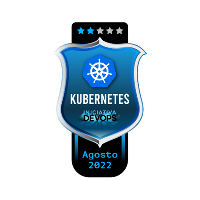</a>
<a href="../credentials/badges/events/devops/220806_GitHub_Actions_PH_Iniciativa_Devops.png">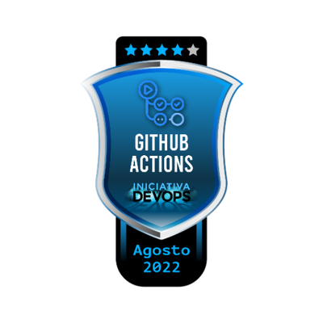</a>
<a href="../credentials/badges/events/devops/220806_Terraform_PH_Iniciativa_Devops.png">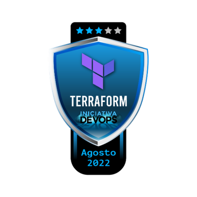</a>

<a href="../credentials/badges/events/network/250926_Networking_Academy_PH_CNA.png">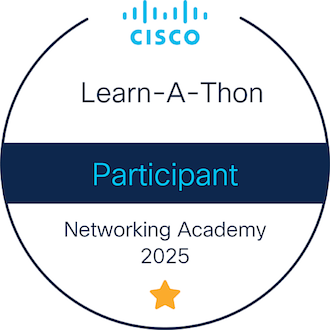</a>