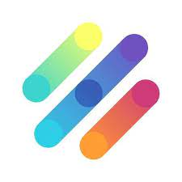
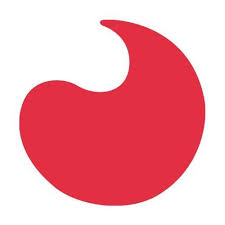

<!-- # Certificações/Certificados de Idiomas -->
#  Certificações/Certificados de Idiomas
[Retornar para a pasta Credenciais](../)

English

    <ul>
        <li>

English Level A1 | Starter

            <ul>
                <li><a href="./ingles/230616_Cert_A1_PH_LP.pdf">Certificado Antigo (PDF)</a></li>
                <li><a href="./ingles/250618_Cert_A1_PH_LP.pdf">Certificado em Português (PDF)</a></li>
                <li><a href="./ingles/250618_Cert_A1_ING_PH_LP.pdf">Certificado em Inglês (PDF)</a></li>
                <li><strong>Plataforma:</strong> Lingopass </li>
                <li><strong>Concluído em:</strong> 16/06/2023</li>
                <li><strong>Carga Horária:</strong> 60 Horas</li>
            </ul>
        
</li>
        <li>

Intermediário–Avançado

            <ul>
                <li><a href="./ingles/160128_Cert_Inter-Avanc_Ingles_PH_ACBEU.pdf">Certificado (PDF)</a></li>
                <li><a href="./ingles/160128_Histor_Academ_Ingles_PH_ACBEU.pdf">Histórico Acadêmico (PDF)</a></li>
                <li><strong>Plataforma:</strong> ACBEU – Associação Cultural Brasil–Estados Unidos </li>
                <li><strong>Concluído em:</strong> 28/01/2016</li>
                <li><strong>Carga Horária:</strong> Não Informada</li>
            </ul>
        
</li>
    </ul>

