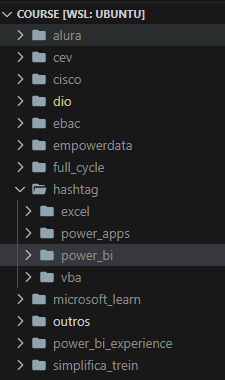
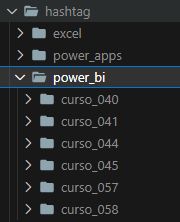
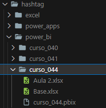

<!-- # Organização -->
#  Organização
[Retornar para a pasta Meu GitHub](../)

A organização do meu GitHub começa com a criação de uma pasta no meu Google Drive, que se torna um repositório local. Em paralelo, crio um repositório remoto correspondente no GitHub e faço a vinculação por meio do Git. Dessa forma, o Google Drive funciona como backup de todos os meus arquivos, enquanto eu decido quais deles devem ser versionados e enviados ao GitHub. Alguns arquivos não são versionados propositalmente, permanecendo apenas no Drive, com o objetivo de otimizar espaço e manter o repositório mais enxuto.

Em relação aos repositórios, minha proposta é agrupar projetos relacionados em um único repositório, evitando a criação excessiva de repositórios separados. Por exemplo:
- O repositório **Boot** concentra todos os cursos mais extensos, como bootcamps, trilhas, programas de formação, cursos ao vivo e formações completas.
- O repositório **Course** reúne cursos menores e mais diretos.
- O repositório **Video** organiza videoaulas avulsas.

Esses três repositórios compõe a categoria de **repositórios de estudo**.

Quando há uma necessidade específica, crio um repositório dedicado, como é o caso do **Aws_skb**, voltado exclusivamente para estudos relacionados à nuvem AWS. Esses são categorizados como **repositórios especiais**.

Existe ainda uma terceira categoria: os **repositórios informativos**, que documentam minha trajetória, estrutura e organização geral. Alguns exemplos são:
- **My Tech Journey** (este repositório, atual principal)
- **Main** (repositório anterior que tinha a mesma função deste)
- **Img** (repositório de imagens utilizadas nos READMEs)
- **Pedroheeger** (repositório de perfil)

Nos repositórios de estudo, adoto uma estrutura hierárquica organizada em três níveis:
1. **Plataforma** (onde o curso foi realizado)
2. **Assunto ou software** abordado
3. **Código de controle do curso/bootcamp**, vinculado a uma planilha do Excel onde faço a gestão de todos os cursos realizados ou planejados.

Dentro da pasta de cada curso ou bootcamp, estão armazenados todos os materiais relacionados. Quando o conteúdo é muito extenso e dividido em módulos, também organizo essas subdivisões em pastas específicas.

Nos repositórios especiais, procuro manter a mesma lógica estrutural dos repositórios de estudo, adaptando-a conforme a necessidade de cada caso.

  <table style="border: 1px solid transparent;">
    <tr>
      <td align="center">
         
        Primeiro Nível de Pastas
      </td>
      <td align="center">
         
        Segundo Nível de Pastas
      </td>
      <td align="center">
         
        Terceiro Nível de Pastas
      </td>
      <td align="center">
         
        Pasta com Material de Estudo
      </td>
    </tr>
  </table>

