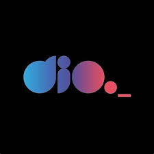
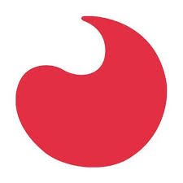

<!-- # Plataformas -->
#  Plataformas de Estudos
[Retornar para a pasta raíz](../)

    <h3 style="text-align: center;">📌 Principais</h3>
    

        
        
        
        
        
        
        
        
        
        
    

    <h3 style="text-align: center;">📎 Secundárias</h3>
    

        
        
        
        
        
        
        
        
        
        
    

    <h3 style="text-align: center;">🗣️ Languages</h3>
    

        
        
    

