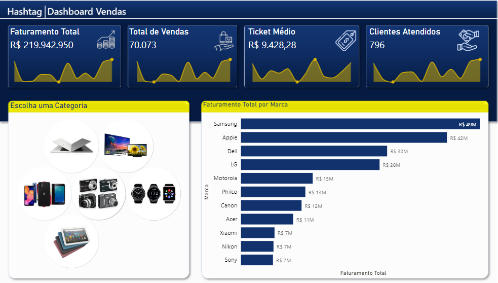
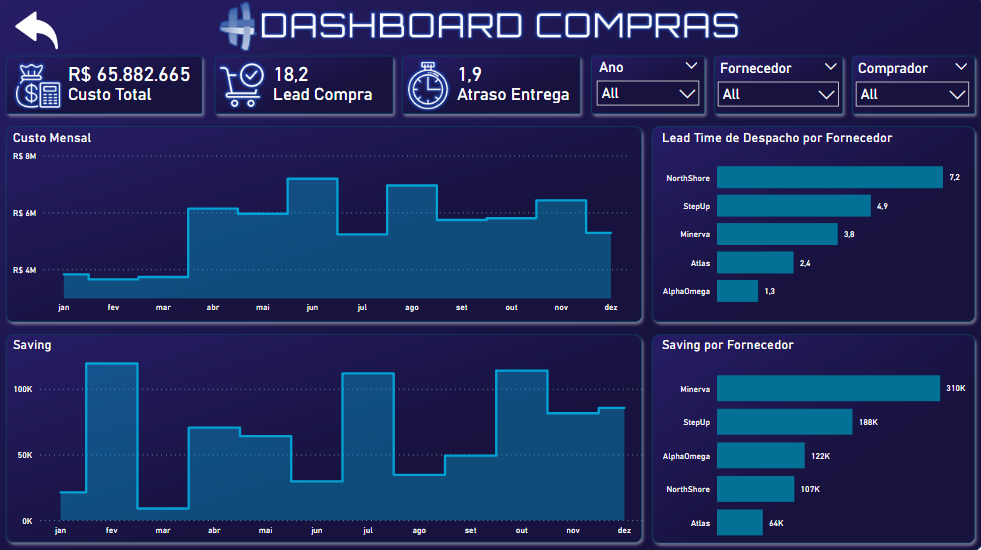

<!-- # Relatórios e Dashboards -->
#  Relatórios e Dashboards
[Retornar para a pasta Projetos](../)

<b>Excel </b>

  <ul>
    <li>

<b>Jornada do Excel 2023</b> - Hashtag Treinamentos 

      <ul>
        <li><a href="https://github.com/PedroHeeger/course/tree/main/hashtag/excel/curso_018">Pasta do Projeto</a></li>
        <li>
          
<figure>
             
            <figcaption>Report Vendas.</figcaption>
          </figure>

        </li>
      </ul>
    
</li>
    <li>

<b>Jornada do Excel 2022</b> - Hashtag Treinamentos 

      <ul>
        <li><a href="https://github.com/PedroHeeger/course/tree/main/hashtag/excel/curso_019">Pasta do Projeto</a></li>
        <li>
          
<figure>
             
            <figcaption>Report Vendas.</figcaption>
          </figure>

        </li>
      </ul>
    
</li>
    <li>

<b>Simplifica Power Excel</b> - Simplifica Treinamentos 

      <ul>
        <li><a href="https://github.com/PedroHeeger/course/tree/main/simplifica_trein/power_bi/curso_043">Pasta do Projeto</a></li>
        <li><a href="https://github.com/PedroHeeger/main/blob/main/cert_ti/05-particip/data/power_bi/(23-05-22)%20Cert%20Power%20BI%20e%20Excel%20PH%20Simplifica%20Trein.pdf">Certificado</a></li>
        <li>Aula 1 e 2</li>
        <li>
          
<figure>
             
            <figcaption>Report Atendimentos.</figcaption>
          </figure>

        </li>
      </ul>
    
</li>
    <li>

<b>Simplifica Excel Express</b> - Simplifica Treinamentos 

      <ul>
        <li><a href="https://github.com/PedroHeeger/course/tree/main/simplifica_trein/excel/curso_059">Pasta do Projeto</a></li>
        <li><a href="../cert_ti/05-particip/data/excel/(23-06-17)%20Cert%20Excel%20PH%20Simplif%20Trein%20(Simplifica%20Express).pdf">Certificado</a></li>
        <li>
          
<figure>
             
            <figcaption>Report Vendas.</figcaption>
          </figure>

        </li>
      </ul>
    
</li>
    <li>

<b>Semana do Excel</b> - Hashtag Treinamentos 

      <ul>
        <li><a href="https://github.com/PedroHeeger/course/tree/main/hashtag/excel/curso_060">Pasta do Projeto</a></li>
        <li><a href="../cert_ti/05-particip/data/excel/(23-06-20)%20Cert%20Excel%20PH%20Hashtag%20Trein%20(Semana).pdf">Certificado</a></li>
        <li>
          
<figure>
             
            <figcaption>Report Vendas.</figcaption>
          </figure>

        </li>
      </ul>
    
</li>
    <li>

<b>Semana do Excel na Prática</b> - Empowerdata 

      <ul>
        <li><a href="https://github.com/PedroHeeger/course/tree/main/empowerdata/excel/curso_065">Pasta do Projeto</a></li>
        <li><a href="../cert_ti/05-particip/data/excel/(23-06-22)%20Cert%20Excel%20PH%20Empowerdata%20(Semana).pdf">Certificado</a></li>
        <li>
          
<figure>
             
            <figcaption>Report Logístico.</figcaption>
          </figure>

        </li>
      </ul>
    
</li>
    <li>

<b>Imersão Excel</b> - Karine Lago 

      <ul>
        <li><a href="https://github.com/PedroHeeger/course/tree/main/outros/karine_lago/excel/curso_072">Pasta do Projeto</a></li>
        <li><a href="../cert_ti/05-particip/data/excel/(23-07-06)%20Cert%20Excel%20PH%20Karine%20Lago%20(Imersão).pdf">Certificado</a></li>
        <li>
          
<figure>
             
            <figcaption>Report Vendas.</figcaption>
          </figure>

        </li>
      </ul>
    
</li>
  </ul>

<b>Power BI </b>

    <ul>
        <li>

<b>Intensivão de Power BI 2022</b> - Hashtag Treinamentos 

            <ul>
                <li><a href="https://github.com/PedroHeeger/course/tree/main/hashtag/power_bi/curso_040">Pasta do Projeto</a></li>
                <li>Aula 1
                    
<figure>
                        <a href="https://app.powerbi.com/view?r=eyJrIjoiYmE4OWI5ZDYtNmNkYi00OGQyLWIxMzctYWVlNmJkYWUyZGMyIiwidCI6ImI1NTJmZWJlLWFkMjgtNGI4Ny1iZjI5LTFlODhiYmZkY2I4ZiJ9">
                        <figcaption>Report Compras.</figcaption></a>
                    </figure>

                </li>
                <li>Aula 2
                    
<figure>
                        <a href="https://app.powerbi.com/view?r=eyJrIjoiOTNiZTQ2YjYtODg3Mi00OGE2LTllMDEtYzE2MmMwOGI0Y2E3IiwidCI6ImI1NTJmZWJlLWFkMjgtNGI4Ny1iZjI5LTFlODhiYmZkY2I4ZiJ9">
                        <figcaption>Report Logístico.</figcaption></a>
                    </figure>

                </li>
                <li>Aula 3
                    
<figure>
                        <a href="https://app.powerbi.com/view?r=eyJrIjoiMTRlOGVjY2QtNGEyMy00ZjY0LThkMTAtN2RjMTdhMTNmMzExIiwidCI6ImI1NTJmZWJlLWFkMjgtNGI4Ny1iZjI5LTFlODhiYmZkY2I4ZiJ9">
                        <figcaption>Report Vendas.</figcaption></a>
                    </figure>

                </li>
                <li>Aula 4
                    
<figure>
                        <a href="https://app.powerbi.com/view?r=eyJrIjoiYWUzN2Y1ZWItNWE2Yy00NGQzLWFjNjMtZWEwODI3YTNhNzlhIiwidCI6ImI1NTJmZWJlLWFkMjgtNGI4Ny1iZjI5LTFlODhiYmZkY2I4ZiJ9">
                        <figcaption>Report Projetos.</figcaption></a>
                    </figure>

                </li>
            </ul>
        
</li>
        <li>

<b>Intensivão de Power BI 2023</b> - Hashtag Treinamentos 

            <ul>
                <li><a href="https://github.com/PedroHeeger/course/tree/main/hashtag/power_bi/curso_041">Pasta do Projeto</a></li>
                <li><a href="../cert_ti/05-particip/data/power_bi/(23-05-11)%20Cert%20Power%20BI%20PH%20Hashtag%20(Intensivão).pdf">Certificado</a></li>
                <li>Aula 1
                    
<figure>
                        
                        <figcaption>Report Vendas.</figcaption>
                    </figure>

                </li>
                <li>Aula 2
                    
<figure>
                        
                        <figcaption>Report Produção.</figcaption>
                    </figure>

                </li>
                <li>Aula 3
                    
<figure>
                        
                        <figcaption>Report RH.</figcaption>
                    </figure>

                </li>
                <li>Aula 4
                    
<figure>
                        
                        <figcaption>Report Financeiro.</figcaption>
                    </figure>

                </li>
            </ul>
        
</li>
        <li>

<b>Minicurso Power BI 1</b> - Hashtag Treinamentos 

            <ul>
                <li><a href="https://github.com/PedroHeeger/course/tree/main/hashtag/power_bi/curso_045">Pasta do Projeto</a></li>
                <li>
                    
<figure>
                         
                        <figcaption>Report Vendas.</figcaption>
                    </figure>

                </li>
            </ul>
        
</li>
        <li>

<b>Simplifica Power Excel</b> - Simplifica Treinamentos 

            <ul>
                <li><a href="../cert_ti/05-particip/data/power_bi/(23-05-22)%20Cert%20Power%20BI%20e%20Excel%20PH%20Simplifica%20Trein.pdf">Certificado</a></li>
                <li><a href="https://github.com/PedroHeeger/course/tree/main/simplifica_trein/power_bi/curso_043">Pasta do Projeto</a></li>
                <li>
                    
<figure>
                        <a href="https://app.powerbi.com/view?r=eyJrIjoiNDlkYmU5ZWMtODZjZS00NmE1LWFjZDktZmY5NjA1YTY2MGE3IiwidCI6ImI1NTJmZWJlLWFkMjgtNGI4Ny1iZjI5LTFlODhiYmZkY2I4ZiJ9"> 
                        <figcaption>Report Atendimentos.</figcaption></a>
                    </figure>

                </li>
                <li>
                    
<figure>
                        <a href="https://app.powerbi.com/view?r=eyJrIjoiNDRlNmU5NTMtYjk0ZC00NGI2LTkyYTMtZTdmOWQ2NjhiNDRkIiwidCI6ImI1NTJmZWJlLWFkMjgtNGI4Ny1iZjI5LTFlODhiYmZkY2I4ZiJ9"> 
                        <figcaption>Report Vendas.</figcaption></a>
                    </figure>

                </li>
            </ul>
        
</li>
        <li>

<b>Minicurso Power BI Experience</b> - Xperiun 

            <ul>
                <li><a href="https://github.com/PedroHeeger/course/tree/main/xperiun/power_bi/curso_048">Pasta do Projeto</a></li>
                <li>
                    
<figure>
                        <a href="https://app.powerbi.com/view?r=eyJrIjoiMTRkM2IyZmMtYmE4Ni00MGZmLWFkNmQtZDMwYzNmNzk3OGRjIiwidCI6ImI1NTJmZWJlLWFkMjgtNGI4Ny1iZjI5LTFlODhiYmZkY2I4ZiJ9"> 
                        <figcaption>Report Vendas Modo Dark.</figcaption></a>
                    </figure>

                </li>
                <li>
                    
<figure>
                        <a href="https://app.powerbi.com/view?r=eyJrIjoiMTRkM2IyZmMtYmE4Ni00MGZmLWFkNmQtZDMwYzNmNzk3OGRjIiwidCI6ImI1NTJmZWJlLWFkMjgtNGI4Ny1iZjI5LTFlODhiYmZkY2I4ZiJ9"> 
                        <figcaption>Report Vendas Modo Light.</figcaption></a>
                    </figure>

                </li>
            </ul>
        
</li>
        <li>

<b>Desafio Missão ZERO - Bootcamp HPN</b> - Xperiun 

            <ul>
                <li><a href="https://github.com/PedroHeeger/course/tree/main/xperiun/power_bi/curso_051">Pasta do Projeto</a></li>
                <li>
                    
<figure>
                        <a href="https://app.powerbi.com/view?r=eyJrIjoiNTM1OGExYTItMjYwNi00ZWY1LThiMTAtODYyMmJlNWY2NDU3IiwidCI6ImI1NTJmZWJlLWFkMjgtNGI4Ny1iZjI5LTFlODhiYmZkY2I4ZiJ9"> 
                        <figcaption>Report Vendas.</figcaption></a>
                    </figure>

                </li>
            </ul>
        
</li>
        <li>

<b>Desafio Kickstart 1 | Atendimento Laboratorial</b> - Xperiun 

            <ul>
                <li><a href="https://github.com/PedroHeeger/course/tree/main/xperiun/power_bi/curso_069">Pasta do Projeto</a></li>
                <li>
                    
<figure>
                        <a href="https://app.powerbi.com/view?r=eyJrIjoiOGUyZjM5ZmQtYzE4Yy00YTYxLTg0YzMtMjgzMTYyN2U0MDhiIiwidCI6ImI1NTJmZWJlLWFkMjgtNGI4Ny1iZjI5LTFlODhiYmZkY2I4ZiJ9"> 
                        <figcaption>Report Vendas.</figcaption></a>
                    </figure>

                </li>
            </ul>
        
</li>
        <li>

<b>Acelerador de Carreira com Power BI</b> - Empowerdata 

            <ul>
                <li><a href="../cert_ti/05-particip/data/power_bi/(23-07-16)%20Cert%20Power%20BI%20PH%20Empowerdata%20(Acelerador%20de%20Carreiras).pdf">Certificado</a></li>
                <li><a href="https://github.com/PedroHeeger/course/blob/main/empowerdata/power_bi/curso_073">Pasta do Projeto</a></li>
                <li>
                    
<figure>
                        <a href="https://app.powerbi.com/view?r=eyJrIjoiYTAxY2YwMmEtZGIwZi00Y2EzLThmN2UtYTVlMmRjODEzY2QyIiwidCI6ImI1NTJmZWJlLWFkMjgtNGI4Ny1iZjI5LTFlODhiYmZkY2I4ZiJ9"> 
                        <figcaption>Report Logístico.</figcaption></a>
                    </figure>

                </li>
                <li>
                    
<figure>
                        <a href="https://app.powerbi.com/view?r=eyJrIjoiYjcxODVmNzEtMmU3MS00YTc4LTk0ZDUtZjc2YmI4NjdlYzEzIiwidCI6ImI1NTJmZWJlLWFkMjgtNGI4Ny1iZjI5LTFlODhiYmZkY2I4ZiJ9"> <figcaption>Report Recursos Humanos (RH).
                        </figcaption></a>
                    </figure>

                </li>
                <li>
                    
<figure>
                        <a href="https://app.powerbi.com/view?r=eyJrIjoiZGQ5Nzg0NzItODE3MC00NGI1LWI1NWUtMzI1ZDRmNzkwNjhkIiwidCI6ImI1NTJmZWJlLWFkMjgtNGI4Ny1iZjI5LTFlODhiYmZkY2I4ZiJ9"> 
                        <figcaption>Report Vendas.</figcaption></a>
                    </figure>

                </li>
                <li>
                    
<figure>
                        <a href="https://app.powerbi.com/view?r=eyJrIjoiZGQ5Nzg0NzItODE3MC00NGI1LWI1NWUtMzI1ZDRmNzkwNjhkIiwidCI6ImI1NTJmZWJlLWFkMjgtNGI4Ny1iZjI5LTFlODhiYmZkY2I4ZiJ9"> 
                        <figcaption>Report Vendas (Mobile).</figcaption></a>
                    </figure>

                </li>
            </ul>
        
</li>
        <li>

<b>002 - Desafio Kickstart | Filmes Netflix</b> - Xperiun 

            <ul>
                <li><a href="https://github.com/PedroHeeger/course/tree/main/xperiun/power_bi/curso_074">Pasta do Projeto</a></li>
                <li>
                    
<figure>
                        <a href="https://app.powerbi.com/view?r=eyJrIjoiY2I3Mzg5YTEtYTM2Ni00MTllLThlNjQtZTc3NDkzZTFkZDU0IiwidCI6ImI1NTJmZWJlLWFkMjgtNGI4Ny1iZjI5LTFlODhiYmZkY2I4ZiJ9"> 
                        <figcaption>Report Avaliação de Títulos.</figcaption></a>
                    </figure>

                </li>
            </ul>
        
</li>
        <li>

<b>Simplifica Power BI</b> - Simplifica Treinamentos 

            <ul>
                <li><a href="../cert_ti/05-particip/data/power_bi/">Certificado</a></li>
                <li><a href="https://github.com/PedroHeeger/course/tree/main/simplifica_trein/power_bi/curso_075">Pasta do Projeto</a></li>
                <li><b>Aula 1</b>
                    
<figure>
                        <a href="https://app.powerbi.com/view?r=eyJrIjoiMDQ0MWEwNTMtZjQwMS00ODVhLWEyMGMtMGRlYTQ4ZTU5MWNlIiwidCI6ImI1NTJmZWJlLWFkMjgtNGI4Ny1iZjI5LTFlODhiYmZkY2I4ZiJ9&pageName=ReportSection"> 
                        <figcaption>Report Vendas.</figcaption></a>
                    </figure>

                    
<figure>
                        <a href="https://app.powerbi.com/view?r=eyJrIjoiMDQ0MWEwNTMtZjQwMS00ODVhLWEyMGMtMGRlYTQ4ZTU5MWNlIiwidCI6ImI1NTJmZWJlLWFkMjgtNGI4Ny1iZjI5LTFlODhiYmZkY2I4ZiJ9"> 
                        <figcaption>Report Vendas (Mobile).</figcaption></a>
                    </figure>

                </li>
                <li><b>Aula 2</b>
                    
<figure>
                        <a href="https://app.powerbi.com/view?r=eyJrIjoiNWIxMzJhYzktNTk5Yy00NGM0LWI0Y2QtOGFlNzI2MDM0OTQ1IiwidCI6ImI1NTJmZWJlLWFkMjgtNGI4Ny1iZjI5LTFlODhiYmZkY2I4ZiJ9"> 
                        <figcaption>Report Atendimentos.</figcaption></a>
                    </figure>

                </li>
                <li><b>Aula 3</b>
                    
<figure>
                        <a href="https://app.powerbi.com/view?r=eyJrIjoiMWZjZTIwNjktODQ3Ny00OTg2LWFlYjEtYzQ3MGMwMjM0NzhlIiwidCI6ImI1NTJmZWJlLWFkMjgtNGI4Ny1iZjI5LTFlODhiYmZkY2I4ZiJ9"> 
                        <figcaption>Report Vendas.</figcaption></a>
                    </figure>

                </li>
                <li><b>Aula 4</b>
                    
<figure>
                        <a href="https://app.powerbi.com/view?r=eyJrIjoiY2Y5YTY4ODctZTA5Zi00Y2MyLThmMDYtMjE2MjI3Y2QwZDhmIiwidCI6ImI1NTJmZWJlLWFkMjgtNGI4Ny1iZjI5LTFlODhiYmZkY2I4ZiJ9"> 
                        <figcaption>Report Análise de Perfil.</figcaption></a>
                    </figure>

                </li>
            </ul>
        
</li>
        <li>

<b>Semana Power BI</b> - Cubo Três 

            <ul>
                <li><a href="../cert_ti/05-particip/data/power_bi/">Certificado</a></li>
                <li><a href="https://github.com/PedroHeeger/course/tree/main/cubo_tres/power_bi/curso_091">Pasta do Projeto</a></li>
                <li><b>Aula 1</b>
                    
<figure>
                        <a href="https://app.powerbi.com/view?r=eyJrIjoiNDlhMDYxZjktZGQ1OS00M2E4LThmYTUtNzlkMzY1Zjc0NGRkIiwidCI6ImI1NTJmZWJlLWFkMjgtNGI4Ny1iZjI5LTFlODhiYmZkY2I4ZiJ9"> 
                        <figcaption>Report Comercial.</figcaption></a>
                    </figure>

                </li>
                <li><b>Aula 2</b>
                    
<figure>
                        <a href="https://app.powerbi.com/view?r=eyJrIjoiNDlhMDYxZjktZGQ1OS00M2E4LThmYTUtNzlkMzY1Zjc0NGRkIiwidCI6ImI1NTJmZWJlLWFkMjgtNGI4Ny1iZjI5LTFlODhiYmZkY2I4ZiJ9"> 
                        <figcaption>Report Análise de Produtos.</figcaption></a>
                    </figure>

                </li>
                <li><b>Aula 3</b>
                    
<figure>
                        <a href="https://app.powerbi.com/view?r=eyJrIjoiNDlhMDYxZjktZGQ1OS00M2E4LThmYTUtNzlkMzY1Zjc0NGRkIiwidCI6ImI1NTJmZWJlLWFkMjgtNGI4Ny1iZjI5LTFlODhiYmZkY2I4ZiJ9"> 
                        <figcaption>Report Fluxo de Caixa.</figcaption></a>
                    </figure>

                </li>
            </ul>
        
</li>
    </ul>

<b>Outros Relatórios 📈</b>

  <ul>
    <li><b>Report 1</b>
      
<figure>
         
        <figcaption>Report Compras Layout 1.</figcaption>
      </figure>

      
<figure>
         
        <figcaption>Report Compras Layout 2.</figcaption>
      </figure>

    </li>
    <li><b>Report 2</b>
      
<figure>
         
        <figcaption>Report Fluxo de Caixa.</figcaption>
      </figure>

    </li>
    <li><b>Report 3</b>
      
<figure>
         
        <figcaption>Report Investimentos.</figcaption>
      </figure>

    </li>
    <li><b>Report 4</b>
      
<figure>
         
        <figcaption>Report Produção.</figcaption>
      </figure>

    </li>
    <li><b>Report 5</b>
      
<figure>
         
        <figcaption>Report Vendas.</figcaption>
      </figure>

    </li>
    <li><b>Report 6</b>
      
<figure>
         
        <figcaption>Report Vendas.</figcaption>
      </figure>

    </li>
  </ul>

